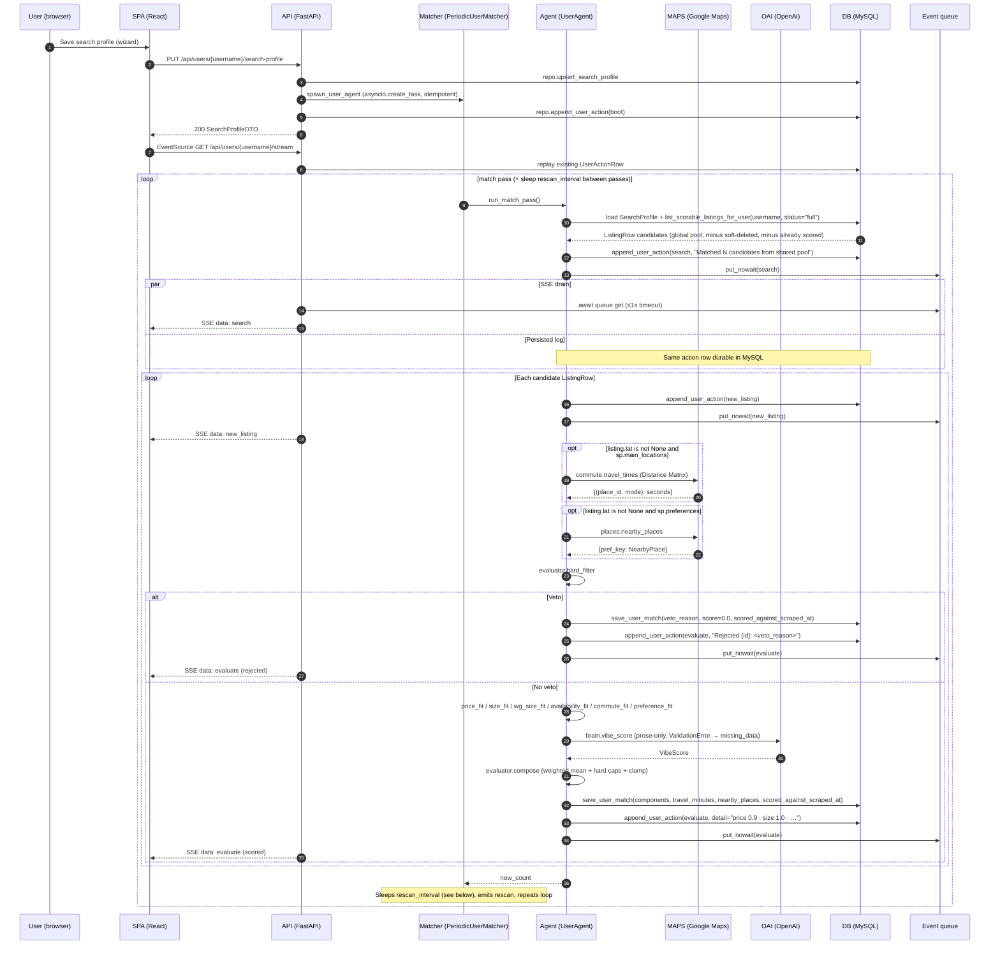

# Agent loop

Two independent loops cooperate through the shared MySQL `ListingRow` pool.

1. The **scraper loop** ([`ScraperAgent.run_forever`](../backend/app/scraper/agent.py)) keeps the pool fresh, independent of any user.
2. The **per-user matcher loop** ([`UserAgent.run_match_pass`](../backend/app/wg_agent/periodic.py)) reads that pool for one user and writes `UserListingRow`s.

Background: [ARCHITECTURE.md](./ARCHITECTURE.md), persistence: [DATA_MODEL.md](./DATA_MODEL.md), module tour: [BACKEND.md](./BACKEND.md).

## Scraper pass (ScraperAgent.run_once)

`ScraperAgent` iterates the active source list (built from `SCRAPER_ENABLED_SOURCES`; default `wg-gesucht`). For each source, it iterates each `kind` the source supports; the deletion sweep then runs once per source, scoped to that source's id namespace ([ADR-020](./DECISIONS.md#adr-020-multi-source-listing-identifiers-via-string-namespacing)).

```mermaid
sequenceDiagram
  autonumber
  participant SA as ScraperAgent
  participant SRC as Source plugin (wg-gesucht / tum-living / kleinanzeigen)
  participant DB as MySQL

  loop per source × per kind
    SA->>SRC: search(kind, profile)
    SRC-->>SA: Listing stubs (namespaced id + kind set)
    loop per stub
      SA->>DB: session.get(ListingRow, stub.id)
      DB-->>SA: existing row or None
      alt needs_scrape (missing, not full, or scraped_at older than source.refresh_hours)
        SA->>SRC: scrape_detail(stub)
        alt scrape raises
          SRC-->>SA: exception
          SA->>DB: upsert_global_listing(status="failed", scrape_error=...)
        else scrape succeeds
          SRC-->>SA: enriched Listing
          SA->>DB: upsert_global_listing(status="full" if description + lat/lng else "stub")
          SA->>DB: save_photos(listing_id, urls)
        end
      else recently scraped
        SA->>SA: skip
      end
    end
  end
  loop per source
    SA->>DB: list_active_listing_ids(source=source.name)
    Note over SA: diff active vs ids seen by THIS source; bump per-source miss counter
    opt counter ≥ SCRAPER_DELETION_PASSES
      SA->>DB: mark_listing_deleted (scrape_status='deleted', deleted_at=now)
    end
  end
```

Error paths:

- **Search failure** — `source.search(...)` raises → `_run_source` logs and continues with the next kind / source; `run_forever` sleeps after the full pass and retries. The pool keeps its previous contents.
- **Per-listing scrape failure** — recorded as `scrape_status='failed'` with `scrape_error` set, so the listing is visible in the pool for observability but excluded from the matcher (which filters on `status='full'`).
- **Block-page response** — each source declares its own `looks_like_block_page` (TUM Living: `EBADCSRFTOKEN` / GraphQL-errors-with-null-data; Kleinanzeigen: 403/429/short-body/datadome regex; wg-gesucht: captcha/turnstile markers in the HTML). When detected, the source returns the unmodified stub (or empty list) so the loop persists what it has and retries later instead of crashing.
- **Unexpected exception inside `run_once`** — caught by `run_forever`; logged via `logger.exception`, then the loop sleeps and retries.
- **Per-source deletion sweep** — `ScraperAgent._sweep_deletions_for(source, seen_ids)` runs after each source finishes its kinds. It diffs `repo.list_active_listing_ids(source=source.name)` (rows whose id starts with `f"{source.name}:"`) against the ids that source saw this pass. A per-source counter (`_missing_passes[source.name]`) increments for listings missing from this pass and resets for listings that reappear. When the counter reaches `SCRAPER_DELETION_PASSES` (default `2`), the listing is tombstoned via `repo.mark_listing_deleted`. Per-source scoping (added with [ADR-020](./DECISIONS.md#adr-020-multi-source-listing-identifiers-via-string-namespacing)) means a wg-gesucht-only pass never tombstones Kleinanzeigen / TUM Living rows. A scraper restart effectively starts every listing at zero missing passes.

## One match pass (UserAgent.run_match_pass + SSE)



**Hybrid delivery:** [`stream_user_events`](../backend/app/wg_agent/api.py) first replays actions already stored for the user, then loops: `await asyncio.wait_for(queue.get(), 1.0)` when a queue exists, **then** opens a fresh `Session` and reloads `repo.list_actions_for_user` to emit any newly persisted rows not yet seen (deduped by `(at, kind, summary)`), plus periodic `: keep-alive` lines. There is no end sentinel — the stream is continuous for as long as the client is connected.

**Email digest (per-user, batched, rate-limited).** While the matcher processes candidates it also calls [`UserAgent._maybe_queue_digest_item`](../backend/app/wg_agent/periodic.py) for each scored listing. An item is queued on the in-memory `_NOTIFY_STATE[username]` buffer only when **all** gates pass: the user has a notification email configured, `score >= WG_NOTIFY_THRESHOLD`, and `ListingRow.first_seen_at > UserRow.created_at`. That last gate is the single source of truth for "is this a new listing?" — it mechanically excludes every listing the scraper wrote before the account was created, so the initial post-signup scoring pass never emails, and it works identically whether the scraper runs on the server or on a developer laptop (both write the same `first_seen_at` into the shared MySQL). At the end of `run_match_pass`, [`_try_flush_digest`](../backend/app/wg_agent/periodic.py) checks `datetime.utcnow() - last_sent_at >= WG_NOTIFY_COOLDOWN_MINUTES` (default `5`): if yes, [`notifier.send_digest_email`](../backend/app/wg_agent/notifier.py) sends one SES email containing every queued item, the buffer is cleared, and `last_sent_at` is stamped; if no, the buffer is preserved and the next eligible pass flushes it. Backend restarts reset the cooldown and drop pending items — that is acceptable because the same `first_seen_at` filter requeues any still-new listing on the next pass.

**Membership invariant:** `repo.list_user_listings` joins `UserListingRow JOIN ListingRow` on `username`, filtering out rows where `ListingRow.deleted_at IS NOT NULL`. A listing only appears in a user's dashboard after the matcher has written a `UserListingRow` for it — which includes veto rows with `score=0.0`. Users never see listings the scraper hasn't deep-scraped (`scrape_status != 'full'` is filtered out by `list_scorable_listings_for_user`) or has since tombstoned.

## Error paths

- **Scraper offline** — If the scraper container is stopped, the pool stops growing but existing listings remain scorable. Match passes still produce scores; the SSE `search` action reads "Matched 0 candidates from shared pool" once the user has scored everything.
- **Per-listing score failure** — The `try`/`except` inside the candidate loop logs `ActionKind.error` with the listing id, pushes to the queue, and `continue`s. Already-scored listings from successful iterations remain.
- **Schema bootstrap failure during startup** — If `db.init_db()` raises inside [`lifespan`](../backend/app/main.py) or [`app/scraper/main.py`](../backend/app/scraper/main.py) (typically: one of `DB_HOST`/`DB_PORT`/`DB_USER`/`DB_PASSWORD`/`DB_NAME` is missing, MySQL is unreachable, or `SQLModel.metadata.create_all` hits a permissions error), the respective process fails startup and does not serve traffic / scrape until the environment is fixed.
- **SSE client disconnect** — Closing the browser tab stops the `EventSource`, but the underlying asyncio per-user task keeps running. A later reconnect receives a full DB replay first, then live events.

## Rescan behavior

`PeriodicUserMatcher` stores `interval_minutes` from the saved `SearchProfile.rescan_interval_minutes` when spawning. The constructor may replace that interval with the integer from **`WG_RESCAN_INTERVAL_MINUTES`** (when the env var parses to a positive int) to shorten waits during demos. After each successful `run_match_pass`, the matcher `await asyncio.sleep(self._sleep_seconds())`, then `_emit_rescan` writes a `rescan` action before the next pass. Any listings the scraper has added during the sleep show up in the next `list_scorable_listings_for_user` call, so rescans surface new inventory without any coupling between the two loops. The matcher has **no terminal state** — cancellation is the only exit.

## Resumption

[`resume_user_agents`](../backend/app/wg_agent/periodic.py) queries `repo.list_usernames_with_search_profile()` using the process-global engine, then for each username re-reads `SearchProfile` (defaulting rescan to **30** minutes if missing) and calls `spawn_user_agent`. This is why per-user agents survive `uvicorn --reload` or other backend-container restarts: the durable `SearchProfileRow` existence is the source of truth, and in-memory registries (`_ACTIVE_AGENTS` plus the per-user `_SUBSCRIBERS` fan-out list populated lazily on the next SSE connection) are rebuilt on boot. The scraper container has its own simple recovery path — `run_forever` always starts fresh after a crash / restart, and its `_missing_passes` counter is in-memory only.
