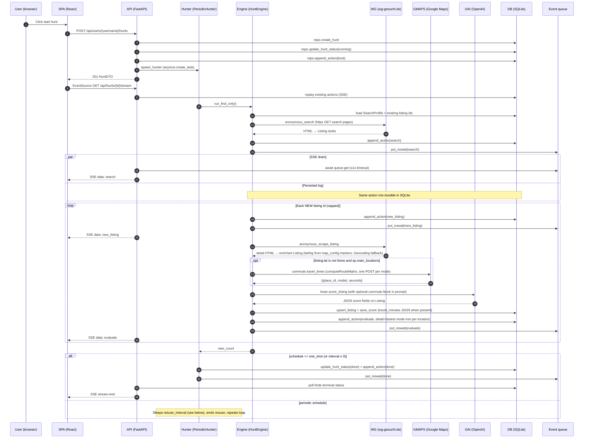

# Agent loop

End-to-end description of one **find pass** inside [`HuntEngine.run_find_only`](../backend/app/wg_agent/periodic.py) and how that interacts with the HTTP API, SQLite, SSE, and external services. Background context: [ARCHITECTURE.md](./ARCHITECTURE.md), persistence: [DATA_MODEL.md](./DATA_MODEL.md), module tour: [BACKEND.md](./BACKEND.md).

## One `run_find_only` pass (happy path + SSE)

**Hybrid delivery:** [`stream_hunt`](../backend/app/wg_agent/api.py) first replays actions already stored for the hunt, then loops: `await asyncio.wait_for(queue.get(), 1.0)` when a queue exists, **then** opens a fresh `Session` to `repo.get_hunt` and emits any newly persisted rows not yet seen (deduped by `(at, kind, summary)`), emits `: keep-alive`, and terminates with a synthetic `stream-end` payload once `HuntStatus` is `done` or `failed`.

## Error paths

- **Anonymous search raises (unexpected exception)** — `HuntEngine.run_find_only` catches, writes an `ActionKind.error` row, pushes the same action to the queue, and returns `0` without flipping hunt status inside the engine. `PeriodicHunter` still exits its loop according to schedule and calls `_finalize_done`, so the hunt row typically ends **`done`**, not `failed`, unless the outer `start()` coroutine hits a different uncaught exception (which uses `_finalize_failed`).
- **`anonymous_search` hits per-request HTTP failures** — Inside [`browser.anonymous_search`](../backend/app/wg_agent/browser.py), `httpx.HTTPError` breaks the page loop and returns partial results rather than raising; the engine proceeds with whatever stubs were collected.
- **Per-listing scrape or score failure** — The `try`/`except` inside the listing loop logs `ActionKind.error` with the listing id, pushes to the queue, and **`continue`**s with the next id; persisted listings from successful iterations remain.
- **Alembic failure during startup** — If `command.upgrade` raises inside [`lifespan`](../backend/app/main.py), FastAPI startup fails and the process does not serve traffic until the migration issue is resolved.
- **SSE client disconnect** — Closing the browser tab stops the `EventSource`, but the underlying asyncio hunt task keeps running: actions continue to append to SQLite and (while the process stays up) the queue. A later reconnect receives a **full DB replay** first, then live events.

## Rescan behavior

`PeriodicHunter` stores `interval_minutes` from the hunt body override or the saved `SearchProfile.rescan_interval_minutes` when spawning from the API ([`create_hunt`](../backend/app/wg_agent/api.py)). For `schedule == "periodic"` with a positive interval, the constructor may replace that interval with the integer from **`WG_RESCAN_INTERVAL_MINUTES`** (when the env var parses to a positive int) to shorten waits during demos. After each successful `run_find_only`, the hunter `await asyncio.sleep(self._sleep_seconds())` (minutes → seconds), then `_emit_rescan` writes a `rescan` action before the next pass.

## Resumption

[`resume_running_hunts`](../backend/app/wg_agent/periodic.py) queries `repo.list_hunts_by_status(HuntStatus.running)` using the process-global engine, then for each row re-reads `SearchProfile` (defaulting rescan to **30** minutes if missing) and calls `spawn_hunter` with the stored `schedule`. This is why hunts survive `uvicorn --reload` or other process restarts: the durable `HuntRow.status` flag is the source of truth, and in-memory registries are rebuilt on boot.
