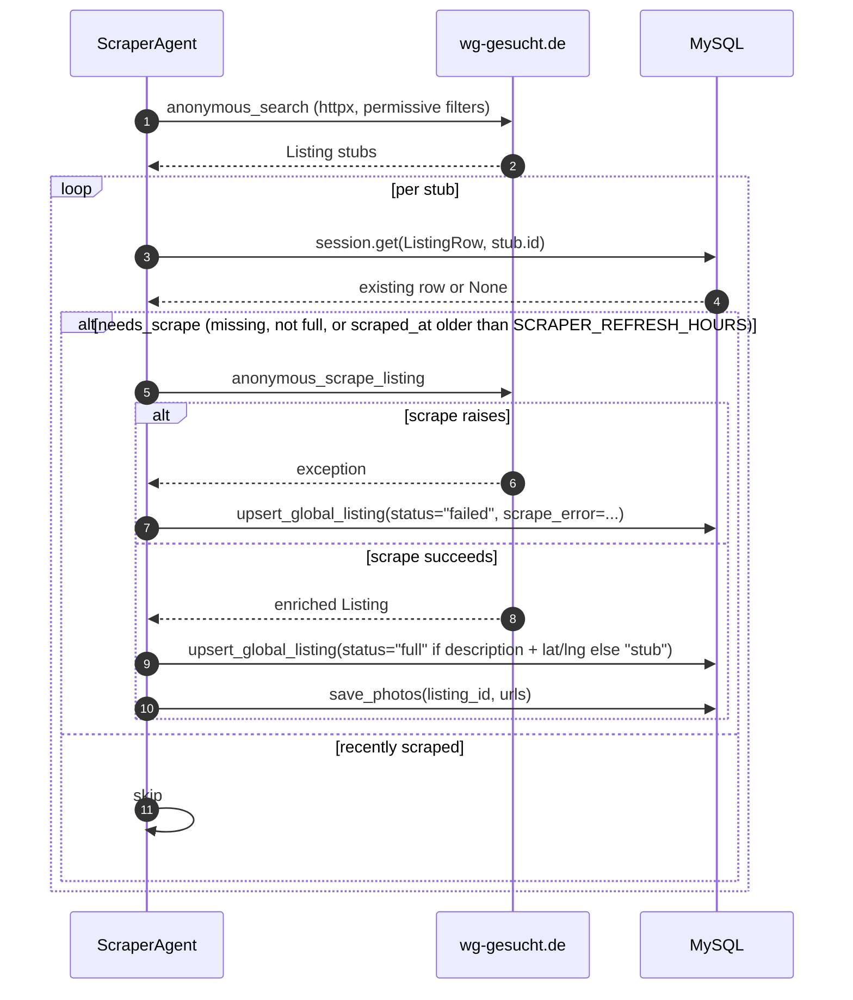
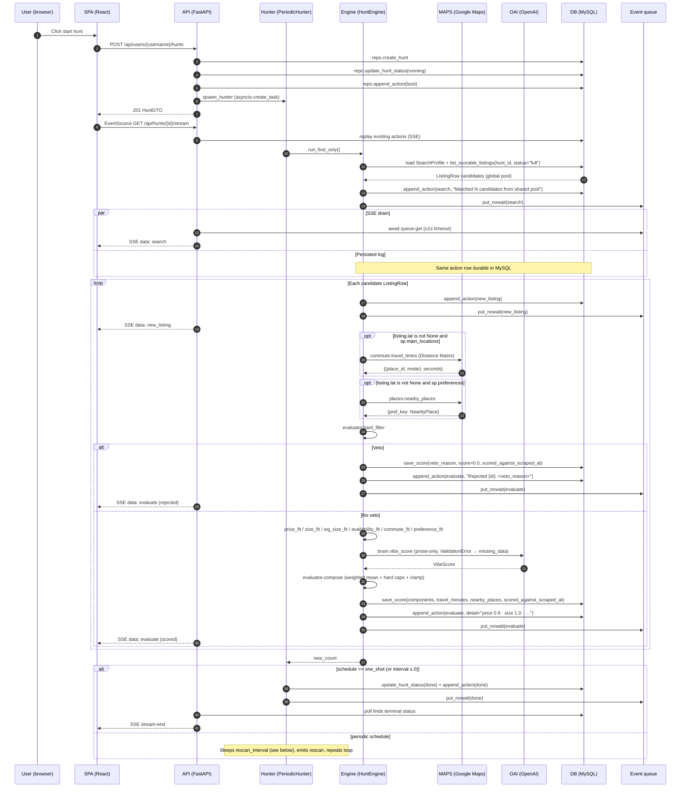

# Agent loop

Two independent loops cooperate through the shared MySQL `ListingRow` pool.

1. The **scraper loop** ([`ScraperAgent.run_forever`](../backend/app/scraper/agent.py)) keeps the pool fresh, independent of any user.
2. The **match loop** ([`HuntEngine.run_find_only`](../backend/app/wg_agent/periodic.py)) reads that pool for one hunt and writes `ListingScoreRow`s.

Background: [ARCHITECTURE.md](./ARCHITECTURE.md), persistence: [DATA_MODEL.md](./DATA_MODEL.md), module tour: [BACKEND.md](./BACKEND.md).

## Scraper pass (ScraperAgent.run_once)

Error paths:

- **Search failure** — `browser.anonymous_search` raises → `run_once` logs and returns `0`; `run_forever` sleeps and retries. The pool keeps its previous contents.
- **Per-listing scrape failure** — recorded as `scrape_status='failed'` with `scrape_error` set, so the listing is visible in the pool for observability but excluded from the matcher (which filters on `status='full'`).
- **Unexpected exception inside `run_once`** — caught by `run_forever`; logged via `logger.exception`, then the loop sleeps and retries.

## One match pass (HuntEngine.run_find_only + SSE)

**Hybrid delivery:** [`stream_hunt`](../backend/app/wg_agent/api.py) first replays actions already stored for the hunt, then loops: `await asyncio.wait_for(queue.get(), 1.0)` when a queue exists, **then** opens a fresh `Session` to `repo.get_hunt` and emits any newly persisted rows not yet seen (deduped by `(at, kind, summary)`), emits `: keep-alive`, and terminates with a synthetic `stream-end` payload once `HuntStatus` is `done` or `failed`.

**Membership invariant:** `repo.get_hunt` → `list_listings_for_hunt` joins `ListingScoreRow JOIN ListingRow`. A listing only appears in the hunt's UI view after the matcher has written a score row for it — which includes veto rows with `score=0.0`. Hunts never contain listings the scraper hasn't deep-scraped (`scrape_status != 'full'` is filtered out by `list_scorable_listings`).

## Error paths

- **Scraper offline** — If the scraper container is stopped, the pool stops growing but existing listings remain scorable. Match passes still produce scores; the SSE `search` action reads "Matched 0 candidates from shared pool" once the hunt has scored everything.
- **Per-listing score failure** — The `try`/`except` inside the candidate loop logs `ActionKind.error` with the listing id, pushes to the queue, and `continue`s. Already-scored listings from successful iterations remain.
- **Schema bootstrap failure during startup** — If `db.init_db()` raises inside [`lifespan`](../backend/app/main.py) or [`app/scraper/main.py`](../backend/app/scraper/main.py) (typically: one of `DB_HOST`/`DB_PORT`/`DB_USER`/`DB_PASSWORD`/`DB_NAME` is missing, MySQL is unreachable, or `SQLModel.metadata.create_all` hits a permissions error), the respective process fails startup and does not serve traffic / scrape until the environment is fixed.
- **SSE client disconnect** — Closing the browser tab stops the `EventSource`, but the underlying asyncio hunt task keeps running. A later reconnect receives a full DB replay first, then live events.

## Rescan behavior

`PeriodicHunter` stores `interval_minutes` from the hunt body override or the saved `SearchProfile.rescan_interval_minutes` when spawning from the API. For `schedule == "periodic"` with a positive interval, the constructor may replace that interval with the integer from **`WG_RESCAN_INTERVAL_MINUTES`** (when the env var parses to a positive int) to shorten waits during demos. After each successful `run_find_only`, the hunter `await asyncio.sleep(self._sleep_seconds())`, then `_emit_rescan` writes a `rescan` action before the next pass. Any listings the scraper has added during the sleep show up in the next `list_scorable_listings` call, so rescans surface new inventory without any coupling between the two loops.

## Resumption

[`resume_running_hunts`](../backend/app/wg_agent/periodic.py) queries `repo.list_hunts_by_status(HuntStatus.running)` using the process-global engine, then for each row re-reads `SearchProfile` (defaulting rescan to **30** minutes if missing) and calls `spawn_hunter` with the stored `schedule`. This is why hunts survive `uvicorn --reload` or other backend-container restarts: the durable `HuntRow.status` flag is the source of truth, and in-memory registries are rebuilt on boot. The scraper container has its own simple recovery path — `run_forever` always starts fresh after a crash / restart.
