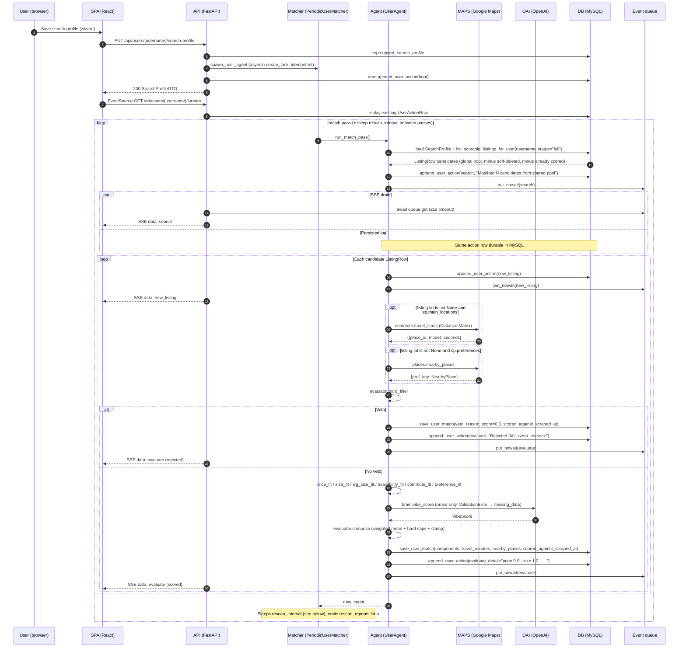

# Agent loop

Two independent loops cooperate through the shared MySQL `ListingRow` pool.

1. The **scraper loop** ([`ScraperAgent.run_forever`](../backend/app/scraper/agent.py)) keeps the pool fresh, independent of any user.
2. The **per-user matcher loop** ([`UserAgent.run_match_pass`](../backend/app/wg_agent/periodic.py)) reads that pool for one user and writes `UserListingRow`s.

Background: [ARCHITECTURE.md](./ARCHITECTURE.md), persistence: [DATA_MODEL.md](./DATA_MODEL.md), module tour: [BACKEND.md](./BACKEND.md).

## Scraper pass (ScraperAgent.run_once)

```mermaid
sequenceDiagram
  autonumber
  participant SA as ScraperAgent
  participant WG as wg-gesucht.de
  participant DB as MySQL

  SA->>WG: anonymous_search (httpx, permissive filters)
  WG-->>SA: Listing stubs
  loop per stub
    SA->>DB: session.get(ListingRow, stub.id)
    DB-->>SA: existing row or None
    alt needs_scrape (missing, not full, or scraped_at older than SCRAPER_REFRESH_HOURS)
      SA->>WG: anonymous_scrape_listing
      alt scrape raises
        WG-->>SA: exception
        SA->>DB: upsert_global_listing(status="failed", scrape_error=...)
      else scrape succeeds
        WG-->>SA: enriched Listing
        SA->>DB: upsert_global_listing(status="full" if description + lat/lng else "stub")
        SA->>DB: save_photos(listing_id, urls)
      end
    else recently scraped
      SA->>SA: skip
    end
  end
  SA->>DB: list_active_listing_ids
  Note over SA: diff active vs search ids; bump per-listing miss counter
  opt counter ≥ SCRAPER_DELETION_PASSES
    SA->>DB: mark_listing_deleted (scrape_status='deleted', deleted_at=now)
  end
```

Error paths:

- **Search failure** — `browser.anonymous_search` raises → `run_once` logs and returns `0`; `run_forever` sleeps and retries. The pool keeps its previous contents.
- **Per-listing scrape failure** — recorded as `scrape_status='failed'` with `scrape_error` set, so the listing is visible in the pool for observability but excluded from the matcher (which filters on `status='full'`).
- **Unexpected exception inside `run_once`** — caught by `run_forever`; logged via `logger.exception`, then the loop sleeps and retries.
- **Deletion sweep** — `ScraperAgent._sweep_deletions` runs after the per-listing loop. It diffs `repo.list_active_listing_ids()` against the ids returned by `anonymous_search`. A per-listing `_missing_passes` counter (process-local) increments for listings missing from this pass and resets for listings that reappear. When the counter reaches `SCRAPER_DELETION_PASSES` (default `2`), the listing is tombstoned via `repo.mark_listing_deleted` (`scrape_status='deleted'`, `deleted_at=now()`). A scraper restart effectively starts every listing at zero missing passes.

## One match pass (UserAgent.run_match_pass + SSE)



**Hybrid delivery:** [`stream_user_events`](../backend/app/wg_agent/api.py) first replays actions already stored for the user, then loops: `await asyncio.wait_for(queue.get(), 1.0)` when a queue exists, **then** opens a fresh `Session` and reloads `repo.list_actions_for_user` to emit any newly persisted rows not yet seen (deduped by `(at, kind, summary)`), plus periodic `: keep-alive` lines. There is no end sentinel — the stream is continuous for as long as the client is connected.

**Membership invariant:** `repo.list_user_listings` joins `UserListingRow JOIN ListingRow` on `username`, filtering out rows where `ListingRow.deleted_at IS NOT NULL`. A listing only appears in a user's dashboard after the matcher has written a `UserListingRow` for it — which includes veto rows with `score=0.0`. Users never see listings the scraper hasn't deep-scraped (`scrape_status != 'full'` is filtered out by `list_scorable_listings_for_user`) or has since tombstoned.

## Error paths

- **Scraper offline** — If the scraper container is stopped, the pool stops growing but existing listings remain scorable. Match passes still produce scores; the SSE `search` action reads "Matched 0 candidates from shared pool" once the user has scored everything.
- **Per-listing score failure** — The `try`/`except` inside the candidate loop logs `ActionKind.error` with the listing id, pushes to the queue, and `continue`s. Already-scored listings from successful iterations remain.
- **Schema bootstrap failure during startup** — If `db.init_db()` raises inside [`lifespan`](../backend/app/main.py) or [`app/scraper/main.py`](../backend/app/scraper/main.py) (typically: one of `DB_HOST`/`DB_PORT`/`DB_USER`/`DB_PASSWORD`/`DB_NAME` is missing, MySQL is unreachable, or `SQLModel.metadata.create_all` hits a permissions error), the respective process fails startup and does not serve traffic / scrape until the environment is fixed.
- **SSE client disconnect** — Closing the browser tab stops the `EventSource`, but the underlying asyncio per-user task keeps running. A later reconnect receives a full DB replay first, then live events.

## Rescan behavior

`PeriodicUserMatcher` stores `interval_minutes` from the saved `SearchProfile.rescan_interval_minutes` when spawning. The constructor may replace that interval with the integer from **`WG_RESCAN_INTERVAL_MINUTES`** (when the env var parses to a positive int) to shorten waits during demos. After each successful `run_match_pass`, the matcher `await asyncio.sleep(self._sleep_seconds())`, then `_emit_rescan` writes a `rescan` action before the next pass. Any listings the scraper has added during the sleep show up in the next `list_scorable_listings_for_user` call, so rescans surface new inventory without any coupling between the two loops. The matcher has **no terminal state** — cancellation is the only exit.

## Resumption

[`resume_user_agents`](../backend/app/wg_agent/periodic.py) queries `repo.list_usernames_with_search_profile()` using the process-global engine, then for each username re-reads `SearchProfile` (defaulting rescan to **30** minutes if missing) and calls `spawn_user_agent`. This is why per-user agents survive `uvicorn --reload` or other backend-container restarts: the durable `SearchProfileRow` existence is the source of truth, and in-memory registries (`_ACTIVE_AGENTS`, `_EVENT_QUEUES`) are rebuilt on boot. The scraper container has its own simple recovery path — `run_forever` always starts fresh after a crash / restart, and its `_missing_passes` counter is in-memory only.
