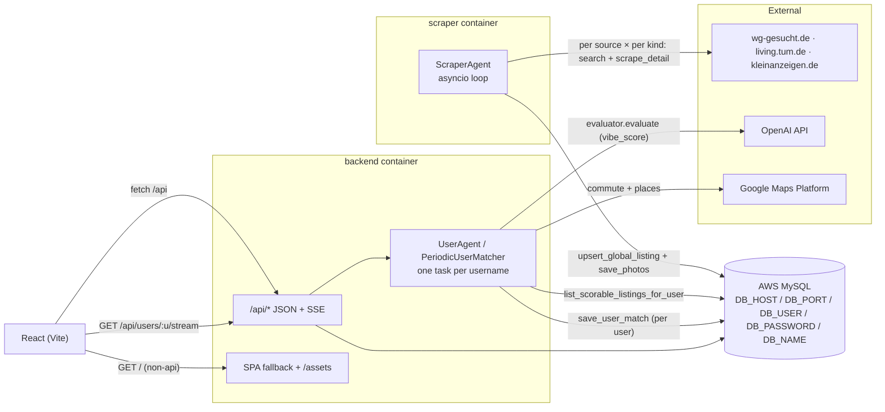
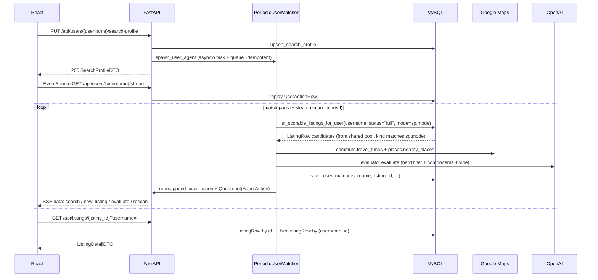
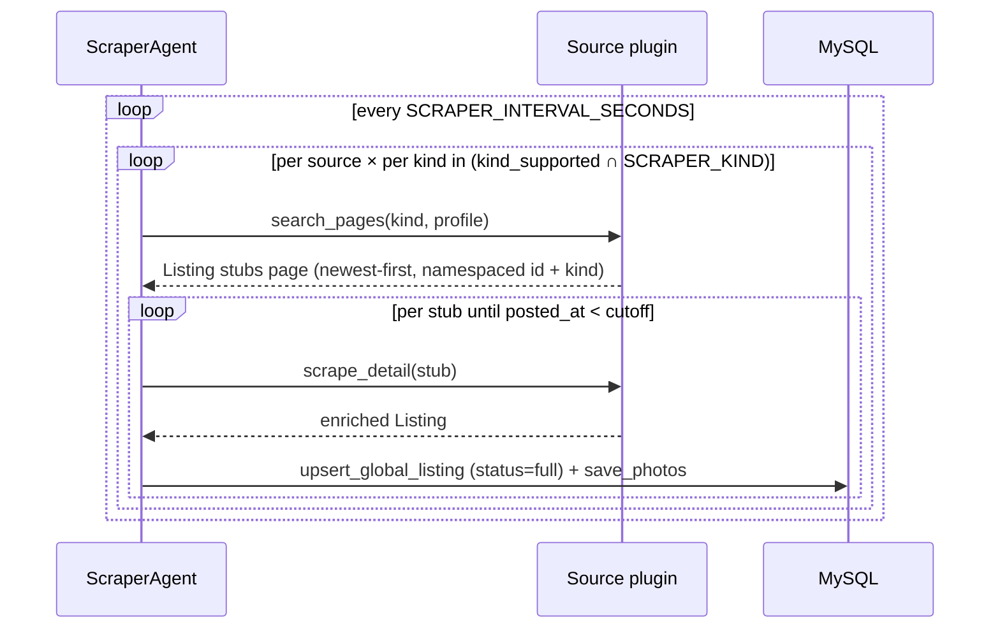

# Architecture

WG Hunter runs as two containers against a shared AWS-hosted MySQL:

1. **backend** — FastAPI process that serves the built React SPA, bootstraps the schema on startup via `SQLModel.metadata.create_all`, and spawns per-user `UserAgent` asyncio tasks that **match** listings from the shared pool (they never scrape).
2. **scraper** — Standalone Python process that owns `ListingRow` + `PhotoRow`. It iterates a registry of `Source` plugins ([`backend/app/scraper/sources/`](../backend/app/scraper/sources/)) — wg-gesucht (default), TUM Living, Kleinanzeigen — selected via `SCRAPER_ENABLED_SOURCES`, deep-scrapes every new listing per source × per kind, and refreshes listings older than the source's `refresh_hours`. Source URLs request newest-first sorting and the agent stops the `(source, kind)` walk the moment a stub's posting date is older than `SCRAPER_MAX_AGE_DAYS` ([ADR-026](./DECISIONS.md#adr-026-drop-the-deletion-sweep-stop-pagination-on-the-first-stale-stub)). `SCRAPER_KIND` (`wg` | `flat` | `both`) restricts which verticals run. Per [ADR-020](./DECISIONS.md#adr-020-multi-source-listing-identifiers-via-string-namespacing), every listing id is namespaced (`f"{source}:{external_id}"`) so cross-source collisions are structurally impossible; per [ADR-021](./DECISIONS.md#adr-021-listing-kind-as-a-first-class-column), every row carries a `kind` (`'wg'` | `'flat'`) so the matcher honors `SearchProfile.mode`.

## Runtime shape

Invariants:

1. Only the scraper writes `ListingRow` and `PhotoRow`.
2. Only the per-user matcher writes `UserListingRow`. A `UserListingRow` row *is* the user ↔ listing membership record — including for vetoed listings (score `0.0`, `veto_reason` set).
3. MySQL is the single source of truth. Both services call `SQLModel.metadata.create_all(engine)` on startup (via `db.init_db()`), which creates any missing tables and no-ops when the schema is already up to date. Destructive changes require a `DROP DATABASE; CREATE DATABASE` — see [SETUP.md](./SETUP.md#reset-the-database).

Fernet key material for credential blobs is resolved in [`crypto.py`](../backend/app/wg_agent/crypto.py): optional `WG_SECRET_KEY`, otherwise a key file under `~/.wg_hunter/secret.key` (shared between containers via the `wg_data` Docker volume).

## Why these choices

- **Split scraping from matching** — The scraper writes once per listing across all users; per-user work is pure scoring. See [ADR-018](./DECISIONS.md#adr-018-separate-scraper-container--global-listingrow-mysql-only).
- **Source-pluggable scraper** — `ScraperAgent` consumes `Source` instances from `app/scraper/sources/` instead of hardcoding wg-gesucht. Each source declares its own pacing (`search_page_delay_seconds`, `detail_delay_seconds`) and refresh window (`refresh_hours`); the loop is otherwise source-agnostic. Pagination is freshness-driven: each source exposes `search_pages` as an async iterator that requests newest-first results, and the agent stops the `(source, kind)` walk the moment a stub's posting date is older than `SCRAPER_MAX_AGE_DAYS` (see [ADR-024](./DECISIONS.md#adr-024-scraper-pagination-terminates-on-first-stub-freshness-not-page-count) and [ADR-026](./DECISIONS.md#adr-026-drop-the-deletion-sweep-stop-pagination-on-the-first-stale-stub)). Adding a new site is a new module + a registry entry. See [ADR-020](./DECISIONS.md#adr-020-multi-source-listing-identifiers-via-string-namespacing) and [ADR-021](./DECISIONS.md#adr-021-listing-kind-as-a-first-class-column).
- **One agent per user (not per hunt)** — The UI has no "start a new hunt" concept anymore: saving a search profile auto-spawns a continuous `UserAgent`, and the backend resumes agents for every user with a `SearchProfileRow` on boot. Listings and actions are keyed by `username`, so the whole hunt-lifecycle state machine (`pending/running/done/failed`) is gone.
- **MySQL on AWS, no local DB** — All developers share one AWS RDS instance via five `DB_*` env vars (`DB_HOST`, `DB_PORT`, `DB_USER`, `DB_PASSWORD`, `DB_NAME`) in `.env`. No docker-compose `mysql` service, no per-developer schema drift. Tests use in-memory SQLite for isolation ([`backend/tests/conftest.py`](../backend/tests/conftest.py) sets inert `DB_*` placeholders so the production `db.py` can import; individual tests then build their own SQLite engine and monkey-patch `db_module.engine`).
- **Vite + React, not Next.js** — No SSR requirement; the UI is a desktop-first SPA. FastAPI serves `frontend/dist/` so one service covers API + static assets.
- **httpx anonymous path** — The scraper uses `browser.anonymous_search` / `anonymous_scrape_listing` without Playwright, keeping cold starts short.
- **SSE instead of WebSockets** — The action log is server → client only. [`api.stream_user_events`](../backend/app/wg_agent/api.py) streams JSON lines plus keep-alives.

## Request flow

Meanwhile, independently of any user, the scraper container runs its own loop:

On process start, [`main.py`](../backend/app/main.py) calls `db.init_db()` (which in turn calls `SQLModel.metadata.create_all(engine)`) and [`periodic.resume_user_agents`](../backend/app/wg_agent/periodic.py) re-spawns one `PeriodicUserMatcher` task per user with a `SearchProfileRow`. The scraper's [`app/scraper/main.py`](../backend/app/scraper/main.py) follows the same `init_db()` path before starting its loop.
