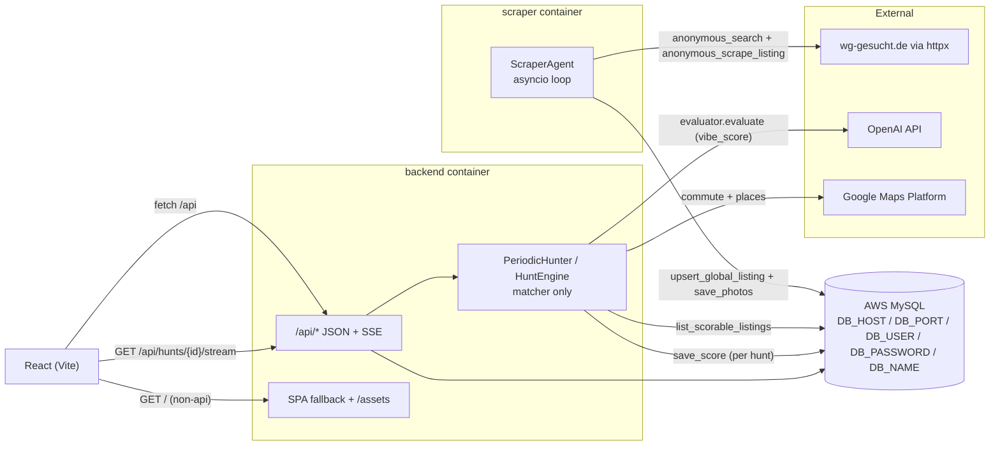
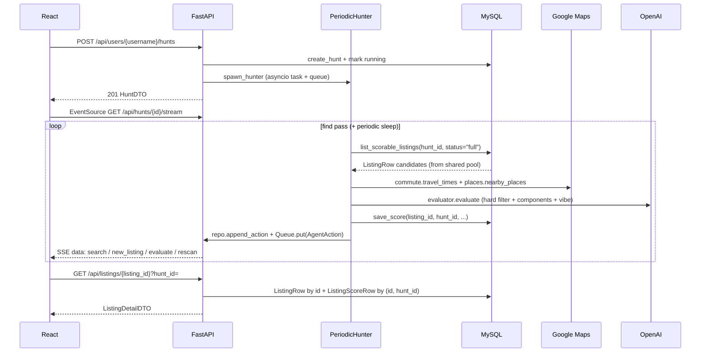
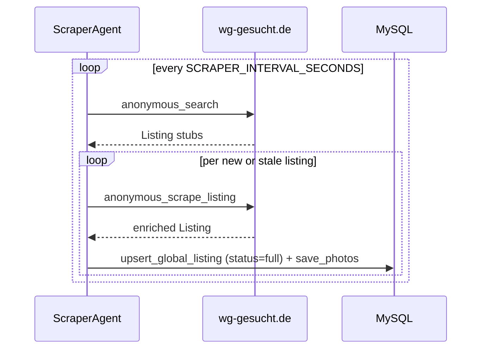

# Architecture

WG Hunter runs as two containers against a shared AWS-hosted MySQL:

1. **backend** — FastAPI process that serves the built React SPA, bootstraps the schema on startup via `SQLModel.metadata.create_all`, and spawns per-hunt `PeriodicHunter` asyncio tasks that **match** listings from the shared pool (they never scrape).
2. **scraper** — Standalone Python process that owns `ListingRow` + `PhotoRow`. It hits `wg-gesucht.de` via httpx on a fixed interval, deep-scrapes every new listing, and refreshes listings older than `SCRAPER_REFRESH_HOURS`.

## Runtime shape

Invariants:

1. Only the scraper writes `ListingRow` and `PhotoRow`.
2. Only hunts write `ListingScoreRow`. A `ListingScoreRow` row *is* the hunt ↔ listing membership record — including for vetoed listings (score `0.0`, `veto_reason` set).
3. MySQL is the single source of truth. Both services call `SQLModel.metadata.create_all(engine)` on startup (via `db.init_db()`), which creates any missing tables and no-ops when the schema is already up to date. Destructive changes require a `DROP DATABASE; CREATE DATABASE` — see [SETUP.md](./SETUP.md#reset-the-database).

Fernet key material for credential blobs is resolved in [`crypto.py`](../backend/app/wg_agent/crypto.py): optional `WG_SECRET_KEY`, otherwise a key file under `~/.wg_hunter/secret.key` (shared between containers via the `wg_data` Docker volume).

## Why these choices

- **Split scraping from matching** — The scraper writes once per listing across all users; per-hunt work is pure scoring. See [ADR-018](./DECISIONS.md#adr-018-separate-scraper-container--global-listingrow-mysql-only).
- **MySQL on AWS, no local DB** — All developers share one AWS RDS instance via five `DB_*` env vars (`DB_HOST`, `DB_PORT`, `DB_USER`, `DB_PASSWORD`, `DB_NAME`) in `.env`. No docker-compose `mysql` service, no per-developer schema drift. Tests use in-memory SQLite for isolation ([`backend/tests/conftest.py`](../backend/tests/conftest.py) sets inert `DB_*` placeholders so the production `db.py` can import; individual tests then build their own SQLite engine and monkey-patch `db_module.engine`).
- **Vite + React, not Next.js** — No SSR requirement; the UI is a desktop-first SPA. FastAPI serves `frontend/dist/` so one service covers API + static assets.
- **httpx anonymous path** — Both the scraper and the legacy orchestrator use `browser.anonymous_search` / `anonymous_scrape_listing` without Playwright, keeping cold starts short.
- **SSE instead of WebSockets** — The action log is server → client only. [`api.stream_hunt`](../backend/app/wg_agent/api.py) streams JSON lines plus keep-alives.

## Request flow

Meanwhile, independently of any hunt, the scraper container runs its own loop:

On process start, [`main.py`](../backend/app/main.py) calls `db.init_db()` (which in turn calls `SQLModel.metadata.create_all(engine)`) and [`periodic.resume_running_hunts`](../backend/app/wg_agent/periodic.py) re-spawns tasks for hunts still marked `running` in MySQL. The scraper's [`app/scraper/main.py`](../backend/app/scraper/main.py) follows the same `init_db()` path before starting its loop.
