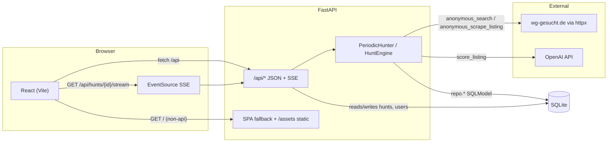
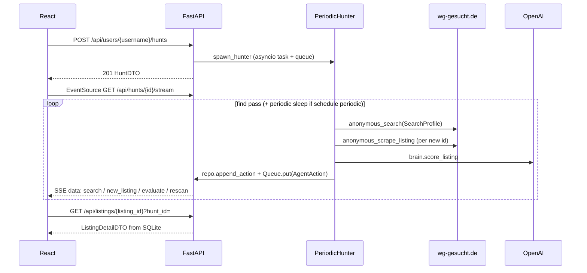

# Architecture

WG Hunter is a single-process demo: a FastAPI app serves the built React SPA, runs Alembic on startup, persists state in SQLite, and schedules an asyncio `PeriodicHunter` task per active hunt.

## Runtime shape

Fernet key material for credential blobs is resolved in [`crypto.py`](../backend/app/wg_agent/crypto.py): optional `WG_SECRET_KEY`, otherwise a key file under `~/.wg_hunter/secret.key`.

## Why these choices

- **Vite + React, not Next.js** — No SSR requirement; the UI is a desktop-first SPA. FastAPI serves `frontend/dist/` so one service is enough for demos and deployment.
- **SQLite + SQLModel** — No separate database process; ACID storage under `~/.wg_hunter/app.db` by default (override with `WG_DB_URL` in [`db.py`](../backend/app/wg_agent/db.py)). WAL mode is enabled for concurrent reads/writes.
- **Fernet for credentials** — Small dependency; symmetric encryption for the JSON payload stored in `WgCredentialsRow`. Keys follow the `crypto.ensure_key()` rules above.
- **httpx anonymous search** — The v1 loop in [`periodic.py`](../backend/app/wg_agent/periodic.py) uses `browser.anonymous_search` / `anonymous_scrape_listing` without Playwright, keeping cold starts short for hackathon demos.
- **SSE instead of WebSockets** — The action log is server → client only. [`api.stream_hunt`](../backend/app/wg_agent/api.py) streams JSON lines plus keep-alives; the client uses `EventSource` in [`api.ts`](../frontend/src/lib/api.ts).
- **Per-hunt listings** — [`ListingRow`](../backend/app/wg_agent/db_models.py) uses composite primary key `(id, hunt_id)`. The same wg-gesucht listing id can exist once per hunt without cross-user collision.

## Request flow

On process start, [`main.py`](../backend/app/main.py) runs `alembic upgrade head` and [`periodic.resume_running_hunts`](../backend/app/wg_agent/periodic.py) re-spawns tasks for hunts still marked `running` in the database.
