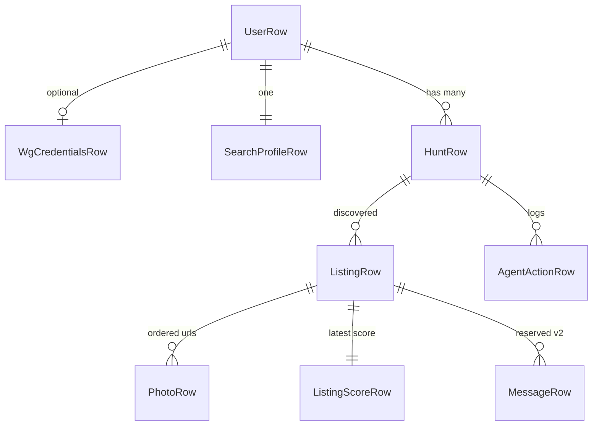
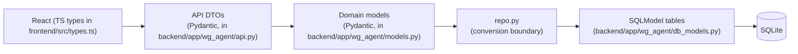
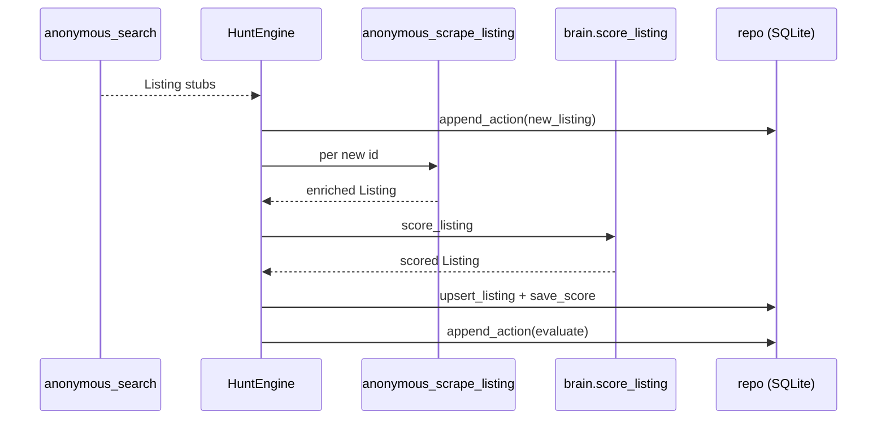

# Data model

SQLite tables mirror [`db_models.py`](../backend/app/wg_agent/db_models.py). Domain aggregates used by the agent are [`Hunt` and nested types](../backend/app/wg_agent/models.py). All ORM ↔ domain conversion goes through [`repo.py`](../backend/app/wg_agent/repo.py) (plus a few direct `Session.get` calls in [`api.py`](../backend/app/wg_agent/api.py) for listing detail assembly).

## Entities

### UserRow

Local account: unique username plus demographics. One row per person using the app.

| Field | Type | Notes |
| ----- | ---- | ----- |
| `username` | `str` | Primary key; chosen handle. |
| `age` | `int` | 16–99 in API validation. |
| `gender` | `str` | Stores `Gender` enum value as string. |
| `created_at` | `datetime` | UTC timestamp when the row was inserted. |

- **SET**: [`repo.create_user`](../backend/app/wg_agent/repo.py) on `POST /api/users`.
- **READ**: [`repo.get_user`](../backend/app/wg_agent/repo.py) for profile fetch and as a guard on nested routes.

### WgCredentialsRow

Optional wg-gesucht credentials as a single Fernet ciphertext blob (JSON inside). Separate from profile so it can be deleted independently.

| Field | Type | Notes |
| ----- | ---- | ----- |
| `username` | `str` | PK + FK → `userrow.username`. |
| `encrypted_payload` | `bytes` | Fernet output from [`crypto.encrypt`](../backend/app/wg_agent/crypto.py). |
| `saved_at` | `datetime` | Last successful upsert time. |

- **SET**: [`repo.upsert_credentials`](../backend/app/wg_agent/repo.py) on `PUT /api/users/{username}/credentials`.
- **READ**: Row existence and `saved_at` via [`repo.credentials_status`](../backend/app/wg_agent/repo.py) for `GET .../credentials` (plaintext never returned).

### SearchProfileRow

One-to-one requirements/preferences schedule slice persisted for the wizard. Maps to domain [`SearchProfile`](../backend/app/wg_agent/models.py) with extra defaults filled in code when building the domain object.

| Field | Type | Notes |
| ----- | ---- | ----- |
| `username` | `str` | PK + FK → `userrow.username`. |
| `price_min_eur` | `int` | Lower rent bound. |
| `price_max_eur` | `Optional[int]` | Upper bound; `None` triggers defaults in repo when building `SearchProfile`. |
| `main_locations` | `JSON` / `list[PlaceLocation]` | User-picked places from Google Places Autocomplete. Each element is `{label, place_id, lat, lng, max_commute_minutes}`; the first entry's `label` seeds `SearchProfile.city` for the wg-gesucht search URL builder. `lat`/`lng` feed commute-based scoring. `max_commute_minutes` (5–240, nullable) is a per-location soft upper bound the LLM compares against the fastest mode. |
| `has_car` | `bool` | Commute / POI hint. |
| `has_bike` | `bool` | Same. |
| `mode` | `str` | `"wg"`, `"flat"`, or `"both"`. |
| `move_in_from` | `Optional[date]` | |
| `move_in_until` | `Optional[date]` | |
| `preferences` | `JSON` / `list[PreferenceWeight]` | Weighted preference tags from the UI. Each element is `{key, weight}` where `key` is a snake_case tag (e.g. `gym`, `furnished`) and `weight` is 1–5 (5 = must-have). `repo.get_search_profile` tolerates legacy bare-string elements by promoting them to `weight=3`. |
| `rescan_interval_minutes` | `int` | Used when spawning hunts and periodic loops. |
| `schedule` | `str` | `"one_shot"` or `"periodic"`. |
| `updated_at` | `datetime` | Bumped on upsert. |

- **SET**: [`repo.upsert_search_profile`](../backend/app/wg_agent/repo.py) on `PUT /api/users/{username}/search-profile`.
- **READ**: [`repo.get_search_profile`](../backend/app/wg_agent/repo.py) for hunt creation, resumption, and `GET` search profile.

### HuntRow

One agent run or long-lived periodic job for a user.

| Field | Type | Notes |
| ----- | ---- | ----- |
| `id` | `str` | Primary key; 12 hex chars from UUID (`repo.create_hunt`). |
| `username` | `str` | FK → `userrow.username`, indexed. |
| `status` | `str` | Domain [`HuntStatus`](../backend/app/wg_agent/models.py): `pending`, `running`, `done`, `failed`. |
| `schedule` | `str` | `"one_shot"` or `"periodic"` (echoed on DTO). |
| `started_at` | `datetime` | Creation time. |
| `stopped_at` | `Optional[datetime]` | Set when status moves to `done` or `failed`. |

- **SET**: Insert in [`repo.create_hunt`](../backend/app/wg_agent/repo.py); status updates via [`repo.update_hunt_status`](../backend/app/wg_agent/repo.py) from API and periodic runner.
- **READ**: [`session.get(HuntRow, id)`](../backend/app/wg_agent/api.py), [`repo.get_hunt`](../backend/app/wg_agent/repo.py), [`repo.list_hunts_by_status`](../backend/app/wg_agent/repo.py).

### ListingRow

Normalized wg-gesucht listing **for one hunt**. Composite PK `(id, hunt_id)` so listing ids are not global rows.

| Field | Type | Notes |
| ----- | ---- | ----- |
| `id` | `str` | wg-gesucht listing id. |
| `hunt_id` | `str` | FK → `huntrow.id`; part of PK. |
| `url` | `str` | Canonical or long URL as string. |
| `title` | `Optional[str]` | |
| `price_eur` | `Optional[int]` | |
| `size_m2` | `Optional[float]` | |
| `wg_size` | `Optional[int]` | |
| `district` | `Optional[str]` | |
| `lat` | `Optional[float]` | Filled during `anonymous_scrape_listing` by [`geocoder.geocode`](../backend/app/wg_agent/geocoder.py); `None` when the geocoder is skipped or yields no result. |
| `lng` | `Optional[float]` | Same origin as `lat`; paired with it for future commute-based scoring. |
| `available_from` | `Optional[date]` | |
| `available_to` | `Optional[date]` | |
| `description` | `Optional[str]` | Filled after deep scrape. |
| `first_seen_at` | `datetime` | Preserved across upserts. |
| `last_seen_at` | `datetime` | Bumped on each upsert. |

- **SET**: [`repo.upsert_listing`](../backend/app/wg_agent/repo.py) after successful scrape + score in [`HuntEngine.run_find_only`](../backend/app/wg_agent/periodic.py).
- **READ**: [`repo.list_listings_for_hunt`](../backend/app/wg_agent/repo.py) inside `repo.get_hunt`; direct row read in [`api._get_listing_detail`](../backend/app/wg_agent/api.py).

### PhotoRow

Ordered image URLs for a listing drawer. Composite PK `(listing_id, hunt_id, ordinal)`.

| Field | Type | Notes |
| ----- | ---- | ----- |
| `listing_id` | `str` | Part of PK; aligns with `listingrow.id`. |
| `hunt_id` | `str` | Part of PK; aligns with `listingrow.hunt_id`. |
| `ordinal` | `int` | Zero-based order. |
| `url` | `str` | Absolute image URL. |

- **SET**: [`repo.save_photos`](../backend/app/wg_agent/repo.py) (defined for future use; the v1 periodic loop does not call it).
- **READ**: `select(PhotoRow)...` in [`api._get_listing_detail`](../backend/app/wg_agent/api.py).

### ListingScoreRow

Latest LLM score payload per `(listing_id, hunt_id)`. Split from `ListingRow` so history can be added later without widening the listing table.

| Field | Type | Notes |
| ----- | ---- | ----- |
| `listing_id` | `str` | PK part. |
| `hunt_id` | `str` | PK part. |
| `score` | `float` | 0..1 in domain; stored as given. |
| `reason` | `Optional[str]` | Human-readable explanation. |
| `match_reasons` | `JSON` / `list` | |
| `mismatch_reasons` | `JSON` / `list` | |
| `travel_minutes` | `Optional[JSON]` | Fastest `{mode, minutes}` per `main_location.place_id` when commute data was available at score time. Shape: `{"<place_id>": {"mode": "BICYCLE", "minutes": 18}}`. Populated by `HuntEngine.run_find_only` from the full `commute.travel_times` matrix; read back by `_get_listing_detail` and re-keyed by label for the drawer. Added in Alembic [`0004_listing_commute.py`](../backend/alembic/versions/0004_listing_commute.py). |
| `scored_at` | `datetime` | |

- **SET**: [`repo.save_score`](../backend/app/wg_agent/repo.py) immediately after `brain.score_listing` in `HuntEngine.run_find_only`.
- **READ**: Joined in `repo.list_listings_for_hunt` via `_listing_from_row` and in `_get_listing_detail` (the detail endpoint also resolves `place_id` to `main_location.label` for the `travel_minutes_per_location` DTO field).

### AgentActionRow

Append-only audit log for UI and debugging. `kind` is a plain string (not a DB enum) so new action types do not require migrations.

| Field | Type | Notes |
| ----- | ---- | ----- |
| `id` | `Optional[int]` | Autoincrement primary key. |
| `hunt_id` | `str` | FK → `huntrow.id`, indexed. |
| `kind` | `str` | [`ActionKind.value`](../backend/app/wg_agent/models.py). |
| `summary` | `str` | Short line for the log. |
| `detail` | `Optional[str]` | Optional stack or extra text. |
| `listing_id` | `Optional[str]` | When the action refers to one listing. |
| `at` | `datetime` | Timestamp. |

- **SET**: [`repo.append_action`](../backend/app/wg_agent/repo.py) from API boot/stop paths and from `HuntEngine` / `PeriodicHunter`.
- **READ**: [`repo.list_actions_for_hunt`](../backend/app/wg_agent/repo.py); SSE path also reloads actions from DB while draining the live queue.

### MessageRow

Reserved for outbound/inbound landlord messages. Present in Alembic [`0001_initial.py`](../backend/alembic/versions/0001_initial.py); no repository helpers in v1.

| Field | Type | Notes |
| ----- | ---- | ----- |
| `id` | `Optional[int]` | Autoincrement PK. |
| `listing_id` | `str` | Indexed; intended FK target listing id string. |
| `hunt_id` | `str` | Indexed. |
| `direction` | `str` | Planned: `outbound` / `inbound`. |
| `text` | `str` | Message body. |
| `sent_at` | `datetime` | |

- **SET / READ**: Not used by the current JSON API or periodic hunter.

## ER diagram

Alembic enforces FKs from `wgcredentialsrow`, `searchprofilerow`, and `huntrow` to `userrow`; from `listingrow` and `agentactionrow` to `huntrow`. `photorow`, `listingscorerow`, and `messagerow` are keyed by `(listing_id, hunt_id)` (and ordinals or surrogate ids) but **do not** declare SQL-level FKs to `listingrow` in `0001_initial.py`—relationships below match the intended model.



## The three-layer rule (in detail)



### React ([`types.ts`](../frontend/src/types.ts))

The browser owns camelCase TypeScript types that mirror JSON after client-side normalization. Components and hooks never import SQLAlchemy or SQLModel. Network I/O goes through [`api.ts`](../frontend/src/lib/api.ts), which applies `toCamel` / `toSnake` so field names stay consistent with Python’s snake_case on the wire. This layer is disposable at build time: it has no direct knowledge of Alembic revisions or table layout.

### API DTOs ([`dto.py`](../backend/app/wg_agent/dto.py))

Pydantic models such as `UserDTO`, `HuntDTO`, and `UpsertSearchProfileBody` define the HTTP contract: snake_case field names in JSON, validation on input bodies, and explicit conversion helpers (`user_to_dto`, `hunt_to_dto`, `upsert_body_to_search_profile`, …). Route handlers in [`api.py`](../backend/app/wg_agent/api.py) call these helpers rather than returning SQLModel rows. This keeps OpenAPI and static typing aligned with what the React client actually sends and receives.

### Domain models ([`models.py`](../backend/app/wg_agent/models.py))

`SearchProfile`, `Listing`, `Hunt`, `AgentAction`, and related types describe agent semantics (scoring fields on `Listing`, action kinds, hunt status). They are plain Pydantic models with **no** SQLModel mixins. [`brain.py`](../backend/app/wg_agent/brain.py), [`browser.py`](../backend/app/wg_agent/browser.py), and [`periodic.py`](../backend/app/wg_agent/periodic.py) consume and produce these types only.

### Rows ([`db_models.py`](../backend/app/wg_agent/db_models.py)) and [`repo.py`](../backend/app/wg_agent/repo.py)

`*Row` classes map 1:1 to tables. [`repo.py`](../backend/app/wg_agent/repo.py) is the only module that routinely converts between `*Row` instances and domain models (narrow public surface: `create_user`, `get_user`, `upsert_search_profile`, `get_search_profile`, `upsert_credentials`, `delete_credentials`, `credentials_status`, `create_hunt`, `get_hunt`, `update_hunt_status`, `append_action`, `upsert_listing`, `save_score`, `save_photos`, `list_hunts_by_status`, `list_listings_for_hunt`, `list_actions_for_hunt`, plus internal helpers). Exceptions: `api._get_listing_detail` reads `ListingRow` / `PhotoRow` / `ListingScoreRow` directly for the listing drawer endpoint.

## Example JSON for each entity

Values below are illustrative; timestamps are ISO-8601 strings as JSON would show after `model_dump(mode="json")`.

**UserRow**

```json
{
  "username": "lea",
  "age": 23,
  "gender": "female",
  "created_at": "2024-01-02T03:04:05"
}
```

**WgCredentialsRow** (API never returns this; shape is the decrypted JSON inside the blob)

```json
{
  "username": "lea",
  "encrypted_payload": "gAAAAABl…",
  "saved_at": "2024-01-02T04:00:00"
}
```

**SearchProfileRow**

```json
{
  "username": "lea",
  "price_min_eur": 400,
  "price_max_eur": 950,
  "main_locations": [
    {
      "label": "Technische Universität München, Arcisstraße 21",
      "place_id": "ChIJ2V-Mo_l1nkcRfZixfUq4DAE",
      "lat": 48.1497,
      "lng": 11.5679,
      "max_commute_minutes": 25
    },
    {
      "label": "Sendling, München",
      "place_id": "ChIJsendlingPlaceId",
      "lat": 48.1168,
      "lng": 11.5483,
      "max_commute_minutes": null
    }
  ],
  "has_car": true,
  "has_bike": false,
  "mode": "flat",
  "move_in_from": null,
  "move_in_until": null,
  "preferences": [
    { "key": "park", "weight": 5 },
    { "key": "gym", "weight": 2 }
  ],
  "rescan_interval_minutes": 60,
  "schedule": "periodic",
  "updated_at": "2024-01-02T03:04:05"
}
```

**HuntRow**

```json
{
  "id": "a1b2c3d4e5f6",
  "username": "lea",
  "status": "running",
  "schedule": "one_shot",
  "started_at": "2024-01-02T05:00:00",
  "stopped_at": null
}
```

**ListingRow**

```json
{
  "id": "13115694",
  "hunt_id": "a1b2c3d4e5f6",
  "url": "https://www.wg-gesucht.de/13115694.html",
  "title": "Room near Laim S-Bahn",
  "price_eur": 795,
  "size_m2": 14.0,
  "wg_size": 4,
  "district": "Laim",
  "lat": 48.1432,
  "lng": 11.5033,
  "available_from": "2026-05-01",
  "available_to": null,
  "description": "Bright room, shared kitchen…",
  "first_seen_at": "2024-01-02T05:01:00",
  "last_seen_at": "2024-01-02T05:02:10"
}
```

**PhotoRow**

```json
{
  "listing_id": "13115694",
  "hunt_id": "a1b2c3d4e5f6",
  "ordinal": 0,
  "url": "https://www.wg-gesucht.de/gal/…/thumb.jpg"
}
```

**ListingScoreRow**

```json
{
  "listing_id": "13115694",
  "hunt_id": "a1b2c3d4e5f6",
  "score": 0.82,
  "reason": "Good transit match; preferences mention gym nearby.",
  "match_reasons": ["public_transport"],
  "mismatch_reasons": [],
  "travel_minutes": {
    "ChIJ2V-Mo_l1nkcRfZixfUq4DAE": { "mode": "BICYCLE", "minutes": 18 },
    "ChIJsendlingPlaceId": { "mode": "TRANSIT", "minutes": 14 }
  },
  "scored_at": "2024-01-02T05:02:15"
}
```

**AgentActionRow**

```json
{
  "id": 42,
  "hunt_id": "a1b2c3d4e5f6",
  "kind": "evaluate",
  "summary": "Scored 13115694: 0.82",
  "detail": null,
  "listing_id": "13115694",
  "at": "2024-01-02T05:02:15"
}
```

**MessageRow** (schema-only example)

```json
{
  "id": 1,
  "listing_id": "13115694",
  "hunt_id": "a1b2c3d4e5f6",
  "direction": "outbound",
  "text": "Hallo, ich interessiere mich für die Wohnung…",
  "sent_at": "2024-01-02T06:00:00"
}
```

## Field lifecycle for `ListingRow`

1. **Search stub** — `browser.anonymous_search` returns domain `Listing` objects with id, url, title, partial card fields (no long description yet). Nothing is persisted until a listing is treated as new for this hunt.
2. **New id gate** — `HuntEngine` compares ids against `repo.list_listings_for_hunt`; unseen ids get `ActionKind.new_listing` rows first.
3. **Deep scrape** — `browser.anonymous_scrape_listing` fills `description`, address/district, availability, etc., on the in-memory `Listing`.
4. **Score** — `brain.score_listing` mutates the same `Listing` with `score`, `score_reason`, and reason lists.
5. **Persist** — `repo.upsert_listing` writes/merges `ListingRow` (preserving `first_seen_at`, updating `last_seen_at`); `repo.save_score` upserts `ListingScoreRow`.
6. **Re-read** — `GET /api/hunts/{id}` and `GET /api/listings/{id}?hunt_id=` rebuild DTOs via `repo.get_hunt` / `_get_listing_detail`, joining scores (and photos when present).


