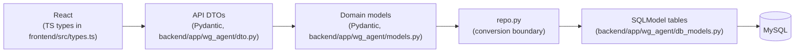

# WG Hunter — developer docs

Autonomous WG-Gesucht room hunter for the TUM.ai Makeathon 2026 ("Campus Co-Pilot" challenge). This folder is the single source of truth for how the system is put together.

**If you're new to the project:** read [What WG Hunter does](#what-wg-hunter-does) below, then follow the [read-in-order](#read-in-order) list. Twenty minutes gets you productive; ninety minutes gets you architectural confidence.

## What WG Hunter does

Two cooperating agents sit on top of a shared MySQL database.

**Scraper container** ([`app/scraper/`](../backend/app/scraper/)) — Runs continuously, independent of any user. Queries `wg-gesucht.de` search pages via **httpx** (anonymous), deep-scrapes every new listing, and writes one global `ListingRow` per wg-gesucht id (with description, `(lat, lng)` from the embedded map config, photos, etc.). Refreshes listings whose `scraped_at` is older than `SCRAPER_REFRESH_HOURS`.

**Backend container** — A student fills a short wizard (demographics, rent/size/commute requirements, weighted preferences) and saves the search profile. The backend spawns a per-user background task (`UserAgent`) that runs continuously and *matches* — never scrapes:

1. Reads candidates from the shared `ListingRow` pool via `repo.list_scorable_listings_for_user(username, status='full')` — only listings the scraper has fully deep-scraped, minus soft-deleted listings, minus listings this user has already scored.
2. For each candidate, asks Google Distance Matrix for commute times per mode and Google Places for nearby-preference distances (if the user configured main locations / preferences).
3. Runs the **scorecard evaluator** — deterministic components (price, size, WG size, availability, commute, preferences) plus one narrow LLM call (`brain.vibe_score`) that judges prose fit only — and composes a weighted score. Listings that fail the deterministic hard filter never reach the LLM.
4. Persists one `UserListingRow` per `(username, listing_id)` (including vetoes with `score=0.0` and `veto_reason` set). This row is also the user ↔ listing membership record — it's what `list_user_listings` joins on.
5. Streams every action to the browser over **Server-Sent Events** so the dashboard's live log and ranked-listings view update in real time. Clicking a listing opens a drawer with the component breakdown, commute times, and a link back to wg-gesucht.

No messaging in v1 — `brain.draft_message` / `classify_reply` / `reply_to_landlord` are staged as dead code for a future iteration but the demo path is strictly *find and surface*.

## Stack at a glance

| Layer | Choice | Why |
| --- | --- | --- |
| Backend | **FastAPI** + async matcher tasks | Hosts API, SSE, per-user matcher loops, and the built SPA |
| Scraper | **Standalone Python container** | Sole writer of `ListingRow` + `PhotoRow`; decouples scrape cadence from per-user match cadence (ADR-018) |
| Persistence | **MySQL (AWS RDS) + SQLModel** | One shared DB for all developers via five `DB_*` env vars; schema is bootstrapped via `SQLModel.metadata.create_all` on startup (ADR-018) |
| Frontend | **Vite + React 19 + TypeScript + Tailwind 3** | Desktop-first SPA, no SSR (ADR-002) |
| Scoring | **Scorecard evaluator** (code) + **OpenAI** (narrow vibe call) | Deterministic components are unit-testable; LLM only judges what it's good at (ADR-015) |
| External | **wg-gesucht.de** (httpx scrape), **Google Maps Platform** (frontend autocomplete + backend geocoding/routing/nearby places), **OpenAI** | No APIs for wg-gesucht exist; we scrape defensively |

## Doc tree

```text
docs/
├── README.md (this file) ── index + read-in-order + three-layer rule
├── SETUP.md ──────────────── clone-to-running in ~30 min + first-contribution recipes
├── ARCHITECTURE.md ──────── runtime shape, request flow, why each piece exists
├── DATA_MODEL.md ─────────── every table with columns + JSON example + ER diagram
├── BACKEND.md ────────────── file-by-file tour of backend/app/wg_agent/
├── FRONTEND.md ───────────── file-by-file tour of frontend/src/
├── AGENT_LOOP.md ─────────── one UserAgent.run_match_pass end-to-end
├── DESIGN.md ─────────────── palette, typography, UI primitives, enforced rules
├── WG_GESUCHT.md ─────────── live recon notes + DOM selectors we depend on
├── DECISIONS.md ──────────── ADR log (ADR-001 … ADR-021)
├── MULTI_SOURCE_SCRAPER_PLAN.md  rollout plan for the multi-source scraper (wg-gesucht / tum-living / kleinanzeigen)
├── ROADMAP.md ────────────── queued / later / done-recently
└── _generated/openapi.json   committed OpenAPI spec (regenerate after API changes)
```

Related files outside `docs/`:

- [`../README.md`](../README.md) — repo-root quick-start, `.env` table, deploy summary.
- [`../CLAUDE.md`](../CLAUDE.md) / [`../AGENTS.md`](../AGENTS.md) — behavioral guidelines + doc tree for coding agents.
- [`../DEPLOYMENT.md`](../DEPLOYMENT.md) / [`../CI-CONFIGURATION.md`](../CI-CONFIGURATION.md) — EC2 + GitHub Actions recipes.
- [`../context/`](../context/) — hackathon background: challenge brief, TUM systems inventory, code samples.
- [`../backend/app/scraper/README.md`](../backend/app/scraper/README.md) — multi-source scraper contract + per-site recon docs (`SOURCE_WG_GESUCHT.md`, `SOURCE_TUM_LIVING.md`, `SOURCE_KLEINANZEIGEN.md`).

## Read in order

1. [**SETUP.md**](./SETUP.md) — clone to running locally in ~30 minutes.
2. [**ARCHITECTURE.md**](./ARCHITECTURE.md) — process shape, request flow, why each piece exists.
3. [**DATA_MODEL.md**](./DATA_MODEL.md) — every table with columns + JSON example, the three-layer rule, ER diagram.
4. [**BACKEND.md**](./BACKEND.md) — file-by-file tour of `backend/app/wg_agent/`.
5. [**FRONTEND.md**](./FRONTEND.md) — file-by-file tour of `frontend/src/`.
6. [**AGENT_LOOP.md**](./AGENT_LOOP.md) — one `UserAgent.run_match_pass` end-to-end (happy path + error paths + rescan + resumption).
7. [**DESIGN.md**](./DESIGN.md) — warm-cream palette, primitives, enforced rules.
8. [**WG_GESUCHT.md**](./WG_GESUCHT.md) — live recon notes and DOM selectors we depend on.
9. [**DECISIONS.md**](./DECISIONS.md) — ADR log. Every non-trivial architecture decision has a record here.
10. [**ROADMAP.md**](./ROADMAP.md) — what's next and what we deliberately left out.
11. [**_generated/openapi.json**](./_generated/openapi.json) — committed OpenAPI spec. Regenerate after API changes (see [below](#regenerating-the-openapi-spec)).

## The three-layer rule

Every API change has to respect this flow. UI sees DTOs; the agent sees domain models; `repo.py` is the **only** boundary between domain and rows.



- UI never imports SQLModel types; it sees only DTOs as JSON.
- Route handlers in [`api.py`](../backend/app/wg_agent/api.py) own DTO ↔ domain conversion via helpers in [`dto.py`](../backend/app/wg_agent/dto.py).
- [`repo.py`](../backend/app/wg_agent/repo.py) owns domain ↔ row conversion.
- [`evaluator.py`](../backend/app/wg_agent/evaluator.py), [`brain.py`](../backend/app/wg_agent/brain.py), [`browser.py`](../backend/app/wg_agent/browser.py), and [`periodic.py`](../backend/app/wg_agent/periodic.py) work exclusively in domain models.

One documented exception: [`api._get_listing_detail`](../backend/app/wg_agent/api.py) reads `*Row` tables directly to assemble the drawer payload. Everything else goes through `repo`.

## What's in v1 (and what isn't)

### In
- Vite + React onboarding (profile → requirements → preferences) and a dashboard with SSE-fed action log and ranked listing cards with a component-breakdown drawer.
- FastAPI serves `frontend/dist/` as SPA and exposes JSON + SSE under `/api/*`.
- MySQL + SQLModel schema bootstrap via `SQLModel.metadata.create_all` on startup; Fernet-encrypted optional wg-gesucht credentials at rest.
- Standalone scraper container ([`app/scraper/`](../backend/app/scraper/)): periodic anonymous listing search + deep scrape via **httpx**, fills the shared global `ListingRow` pool with status/scraped_at/scrape_error bookkeeping (ADR-018).
- `PeriodicUserMatcher` + `UserAgent` **matcher**: iterates `list_scorable_listings_for_user` per user, runs `evaluator.evaluate` (deterministic components + one narrow `brain.vibe_score` LLM call); results persisted per `(username, listing_id)` with `scored_against_scraped_at` set for future rescoring.
- Commute-aware scoring: server-side Google geocoding fallback for listing addresses, Google Distance Matrix per mode, and Google Places lookups for nearby user-preference amenities; the matrix drives `commute_fit`, nearby-place distances drive `preference_fit`, and both appear in the drawer (ADR-017).
- Scorecard evaluator (ADR-015): deterministic hard-filter vetoes + six component curves + narrow vibe LLM + weighted composition with hard caps. Unit-tested curve-by-curve in [`test_evaluator.py`](../backend/tests/test_evaluator.py).

### Out (deliberately, for v1)
- No landlord messaging, inbox polling, or viewing flows in the UI/agent path. The helper functions `brain.draft_message` / `classify_reply` / `reply_to_landlord` still exist as dead code for future work but nothing mounts them.
- No deterministic pre-filter at search-URL level — we fetch and scrape before vetoing. See [`ROADMAP.md`](./ROADMAP.md) for the proposal.
- No learned composition weights. `COMPONENT_WEIGHTS` is hand-picked; user feedback (👍/👎) doesn't exist yet.
- No AWS Bedrock. The challenge brief mentions it; we use OpenAI directly for simpler local setup. See `context/AWS_RESOURCES.md` for the Bedrock notes and `ROADMAP.md` for how we'd swap it in.

## Regenerating the OpenAPI spec

After any API change (new route, new DTO field, route removed), regenerate the committed spec:

```bash
# In one terminal, with the venv activated:
cd backend && venv/bin/uvicorn app.main:app

# In another:
curl -s http://127.0.0.1:8000/openapi.json | python3 -m json.tool > docs/_generated/openapi.json
```

Commit the updated file alongside your API change.

## Related reading (outside `docs/`)

See the [doc tree](#doc-tree) at the top of this file for the full layout across the repo root.
