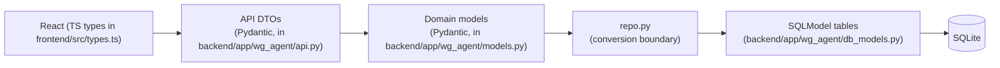

# WG Hunter — docs

Autonomous WG-Gesucht room hunter, TUM.ai Makeathon 2026.

## Read in order

1. [SETUP.md](./SETUP.md) — clone to running locally in about 30 minutes.
2. [ARCHITECTURE.md](./ARCHITECTURE.md) — runtime components and request flow.
3. [DATA_MODEL.md](./DATA_MODEL.md) — tables, ER diagram, three-layer rule, JSON samples.
4. [BACKEND.md](./BACKEND.md) — backend file walkthrough (next doc todo).
5. [FRONTEND.md](./FRONTEND.md) — frontend walkthrough (next doc todo).
6. [AGENT_LOOP.md](./AGENT_LOOP.md) — one hunt iteration in detail (next doc todo).
7. [DESIGN.md](./DESIGN.md) — warm-cream design system (next doc todo).
8. [WG_GESUCHT.md](./WG_GESUCHT.md) — live recon notes and selectors for wg-gesucht.de.
9. [DECISIONS.md](./DECISIONS.md) — ADR log (next doc todo).
10. [_generated/openapi.json](./_generated/openapi.json) — committed OpenAPI spec (next doc todo).

## The three-layer rule (verbatim)

- UI never imports SQLModel types; it sees only DTOs as JSON.
- API route handlers own DTO <-> domain conversion.
- `repo.py` owns domain <-> row conversion.
- The orchestrator and brain work exclusively in domain models.

Implementation note: request/response DTO modules live in [`dto.py`](../backend/app/wg_agent/dto.py); [`api.py`](../backend/app/wg_agent/api.py) wires routes and uses those DTOs.

## What's in v1

- Vite + React onboarding (profile, requirements, preferences) and a dashboard with SSE-fed action log and ranked listing cards (see git history on branch `jasha` from `8d3f6fd` through `1a3af89`).
- FastAPI serves `frontend/dist/` as SPA and exposes JSON + SSE under `/api/*` (`2839f1b`, `0ed255c`).
- SQLite + SQLModel + Alembic migrations; Fernet-encrypted optional wg-gesucht credentials at rest (`8ca9fe2`).
- `PeriodicHunter` + `HuntEngine`: anonymous listing search and per-listing scrape via **httpx**, then `brain.score_listing` with OpenAI; results persisted per `hunt_id` (`2993f37`, `9a964fe`).
- No landlord messaging, inbox polling, or viewing flows in this UI/agent path (orchestrator messaging code remains in the repo for later work).
