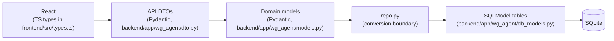

# WG Hunter — developer docs

Autonomous WG-Gesucht room hunter for the TUM.ai Makeathon 2026 ("Campus Co-Pilot" challenge). This folder is the single source of truth for how the system is put together.

**If you're new to the project:** read [What WG Hunter does](#what-wg-hunter-does) below, then follow the [read-in-order](#read-in-order) list. Twenty minutes gets you productive; ninety minutes gets you architectural confidence.

## What WG Hunter does

A student fills a short wizard — demographics, rent/size/commute requirements, weighted preferences (`gym` weight 4, `furnished` weight 5, …) — and clicks **Start hunt**. The backend spins up a background task that:

1. Queries `wg-gesucht.de` search pages via **httpx** (anonymous, no login).
2. For each new listing it hasn't seen in this hunt: deep-scrapes the listing HTML, pulls landlord-precise `(lat, lng)` from the embedded map config, and (if the user configured main locations) asks Google Routes API for commute times per mode.
3. Runs the **scorecard evaluator** — deterministic components (price, size, WG size, availability, commute, preferences) plus one narrow LLM call (`brain.vibe_score`) that judges prose fit only — and composes a weighted score. Listings that fail the deterministic hard filter (over budget, wrong city, avoid-district, etc.) never reach the LLM.
4. Persists everything in SQLite (per-hunt `ListingRow` + `ListingScoreRow`, append-only `AgentActionRow` log).
5. Streams every action to the browser over **Server-Sent Events** so the dashboard's live log and ranked-listings view update in real time. Clicking a listing opens a drawer with the component breakdown, commute times, and a link back to wg-gesucht.

No messaging in v1 — the orchestrator has that code staged for a future iteration but the demo path is strictly *find and surface*.

## Stack at a glance

| Layer | Choice | Why |
| --- | --- | --- |
| Backend | **FastAPI** + async tasks | One process hosts API, SSE, periodic hunt loop, and the built SPA |
| Persistence | **SQLite + SQLModel + Alembic** | Zero external infra for demos; migrations from day one (ADR-001, ADR-005) |
| Frontend | **Vite + React 19 + TypeScript + Tailwind 3** | Desktop-first SPA, no SSR (ADR-002) |
| Scoring | **Scorecard evaluator** (code) + **OpenAI** (narrow vibe call) | Deterministic components are unit-testable; LLM only judges what it's good at (ADR-015) |
| External | **wg-gesucht.de** (httpx scrape), **Google Maps** (Geocoding + Routes), **OpenAI** | No APIs for wg-gesucht exist; we scrape defensively |

## Read in order

1. [**SETUP.md**](./SETUP.md) — clone to running locally in ~30 minutes.
2. [**ARCHITECTURE.md**](./ARCHITECTURE.md) — process shape, request flow, why each piece exists.
3. [**DATA_MODEL.md**](./DATA_MODEL.md) — every table with columns + JSON example, the three-layer rule, ER diagram.
4. [**BACKEND.md**](./BACKEND.md) — file-by-file tour of `backend/app/wg_agent/`.
5. [**FRONTEND.md**](./FRONTEND.md) — file-by-file tour of `frontend/src/`.
6. [**AGENT_LOOP.md**](./AGENT_LOOP.md) — one `HuntEngine.run_find_only` pass end-to-end (happy path + error paths + rescan + resumption).
7. [**DESIGN.md**](./DESIGN.md) — warm-cream palette, primitives, enforced rules.
8. [**WG_GESUCHT.md**](./WG_GESUCHT.md) — live recon notes and DOM selectors we depend on.
9. [**DECISIONS.md**](./DECISIONS.md) — ADR log. Every non-trivial architecture decision has a record here.
10. [**ROADMAP.md**](./ROADMAP.md) — what's next and what we deliberately left out.
11. [**_generated/openapi.json**](./_generated/openapi.json) — committed OpenAPI spec. Regenerate after API changes (see [below](#regenerating-the-openapi-spec)).

## The three-layer rule

Every API change has to respect this flow. UI sees DTOs; the agent sees domain models; `repo.py` is the **only** boundary between domain and rows.



- UI never imports SQLModel types; it sees only DTOs as JSON.
- Route handlers in [`api.py`](../backend/app/wg_agent/api.py) own DTO ↔ domain conversion via helpers in [`dto.py`](../backend/app/wg_agent/dto.py).
- [`repo.py`](../backend/app/wg_agent/repo.py) owns domain ↔ row conversion.
- [`evaluator.py`](../backend/app/wg_agent/evaluator.py), [`brain.py`](../backend/app/wg_agent/brain.py), [`browser.py`](../backend/app/wg_agent/browser.py), and [`periodic.py`](../backend/app/wg_agent/periodic.py) work exclusively in domain models.

One documented exception: [`api._get_listing_detail`](../backend/app/wg_agent/api.py) reads `*Row` tables directly to assemble the drawer payload. Everything else goes through `repo`.

## What's in v1 (and what isn't)

### In
- Vite + React onboarding (profile → requirements → preferences) and a dashboard with SSE-fed action log and ranked listing cards with a component-breakdown drawer.
- FastAPI serves `frontend/dist/` as SPA and exposes JSON + SSE under `/api/*`.
- SQLite + SQLModel + Alembic migrations (through `0006_scorecard_components.py`); Fernet-encrypted optional wg-gesucht credentials at rest.
- `PeriodicHunter` + `HuntEngine`: anonymous listing search and per-listing scrape via **httpx**, then `evaluator.evaluate` (deterministic components + one narrow `brain.vibe_score` LLM call); results persisted per `hunt_id`.
- Commute-aware scoring: server-side Google Geocoding for listing addresses (fallback only — `map_config.markers` usually provides coords) + Google Routes API `computeRouteMatrix` per mode; the matrix drives `commute_fit` and the drawer's commute section (ADR-011, ADR-012).
- Scorecard evaluator (ADR-015): deterministic hard-filter vetoes + six component curves + narrow vibe LLM + weighted composition with hard caps. Unit-tested curve-by-curve in [`test_evaluator.py`](../backend/tests/test_evaluator.py).

### Out (deliberately, for v1)
- No landlord messaging, inbox polling, or viewing flows in the UI/agent path. The orchestrator code in [`orchestrator.py`](../backend/app/wg_agent/orchestrator.py) still exists for future work but nothing mounts it.
- No deterministic pre-filter at search-URL level — we fetch and scrape before vetoing. See [`ROADMAP.md`](./ROADMAP.md) for the proposal.
- No learned composition weights. `COMPONENT_WEIGHTS` is hand-picked; user feedback (👍/👎) doesn't exist yet.
- No AWS Bedrock. The challenge brief mentions it; we use OpenAI directly for simpler local setup. See `context/AWS_RESOURCES.md` for the Bedrock notes and `ROADMAP.md` for how we'd swap it in.

## Regenerating the OpenAPI spec

After any API change (new route, new DTO field, route removed), regenerate the committed spec:

```bash
# In one terminal, with the venv activated:
cd backend && venv/bin/uvicorn app.main:app

# In another:
curl -s http://127.0.0.1:8000/openapi.json | python3 -m json.tool > docs/_generated/openapi.json
```

Commit the updated file alongside your API change.

## Related reading (outside `docs/`)

- [`../README.md`](../README.md) — repo root quick-start, AWS deploy, `.env` table.
- [`../CLAUDE.md`](../CLAUDE.md) / [`../AGENTS.md`](../AGENTS.md) — behavioral guidelines for human contributors and coding agents.
- [`../context/`](../context/) — hackathon background: challenge brief, TUM systems inventory, AWS/Bedrock reference code, event logistics.
- [`../DEPLOYMENT.md`](../DEPLOYMENT.md) / [`../CI-CONFIGURATION.md`](../CI-CONFIGURATION.md) — EC2 + GitHub Actions recipes.
